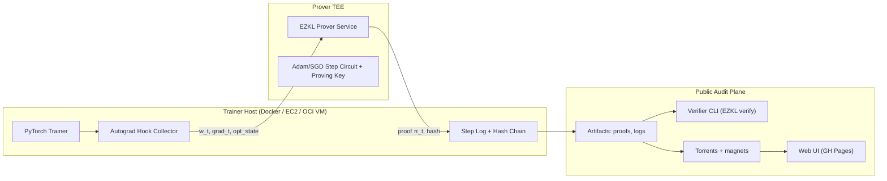
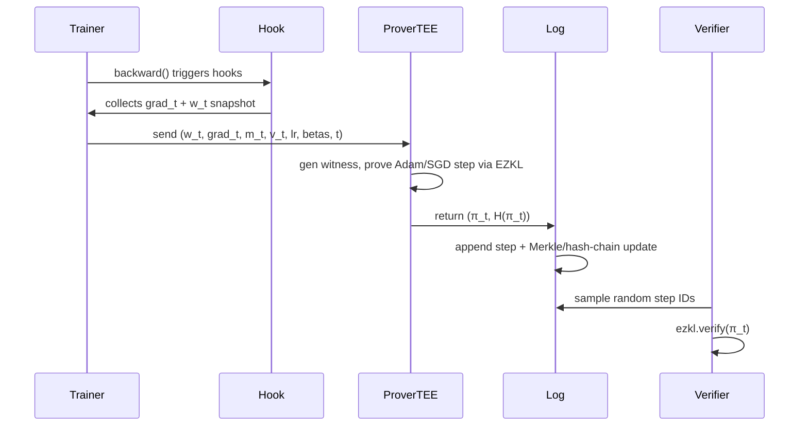

# zk-Autograd: Verifiable Training Step Proofs (EZKL + TEEs)

**zk-Autograd** is a proof-of-concept training pipeline where **every optimizer step emits a zero‑knowledge proof** that the update was computed honestly from the previous weights, batch gradients, and declared optimizer rules. Proofs are generated inside a **TEE (AWS Nitro Enclave or OCI Confidential VM)** so proving keys and intermediate values never leave protected memory. Public artifacts (proof hashes, logs, and torrents) enable third‑party audit of fine‑tuning runs **without revealing training data or model weights.**

> **Status:** PoC / research prototype. Not for production use.

---

## Architecture



### Sequence



---

## EZKL backend

EZKL generates Halo2-based zk‑SNARK circuits over ONNX graphs and provides Python bindings for setup, witness generation, proving, and verification. citeturn2search1turn1view0turn2search5

PoC circuits:

- **Adam step** (default): proves `{m_{t+1}, v_{t+1}, w_{t+1}}` from `{w_t, g_t, m_t, v_t, lr, beta1, beta2, eps, t}`.
- **SGD step** (optional).

### Proof splitting & aggregation

Large graphs can be split into multiple proofs using EZKL commitments and then aggregated into a single proof. citeturn0search0turn0search16turn0search12

PoC fallback:
Set `EZKL_CHUNKS=N` to slice flattened optimizer vectors into N blocks, generate N chunk proofs, and aggregate them into a single `aggregated.pf`.

```bash
EZKL_CHUNKS=4 docker compose up --build
```

Setup artifacts live in `prover/keys/`:

- `settings.json`, `compiled.ezkl`, `pk.key`, `vk.key`, `kzg.srs`, and `adam_step.onnx`.

Generate them locally:

```bash
zk-setup-zk --circuit adam --dim 128 --out prover/keys
```

---

## Trust assumptions & threat model (PoC)

### Adversaries

- Honest‑but‑curious host observing runtime/logs.
- Malicious host attempting to fabricate/skip/rollback steps.
- Malicious auditor sampling proofs.

### Trust anchors

- **TEE attestation gates proving key release.**
  - Nitro Enclaves attest enclave image PCRs and KMS can restrict key use to a specific enclave measurement. citeturn0search2turn0search6turn0search10turn0search13
  - OCI Confidential VMs use AMD SEV‑based memory encryption and support measurement‑based attestation concepts. citeturn0search7turn0search14turn3search31
- ZK backend is sound.
- Log integrity via hash‑chain + Merkle root.

---

## Quickstart (local Docker)

Requirements: Docker + Compose.

```bash
# 1) Prepare EZKL circuit and keys
zk-setup-zk --circuit adam --out prover/keys

# 2) Run prover + trainer
docker compose -f docker/docker-compose.yml up --build
```

Artifacts emit to `artifacts/run-*/`:

- `steps.jsonl` – per step metadata + proof hash
- `proofs/step_XXXXX.proof` – EZKL proofs
- `merkle_root.txt` – run root
- `run_manifest.json` – pointers for web UI/torrents
- `anchors.json` – monotonic counter anchors (local PoC)

---

## Demo Notebook

For an interactive walkthrough of the project's features, check out `demo.ipynb`. This Jupyter notebook provides a comprehensive demonstration of:

1. **Setup & Compilation**: How to compile ZK circuits for the optimizer.
2. **Provable Training**: Running a toy training loop with audit logging.
3. **Audit Log Inspection**: Examining the cryptographic log and Merkle tree.
4. **Verification**: Verifying generated ZK proofs.
5. **Advanced Features**: Exploring Triton kernels and proof chunking.
6. **Decentralized Storage**: Creating torrent bundles for training artifacts.

It is designed to be a self-contained guide for understanding the end-to-end flow of **zk-Autograd**.

---

## Cloud targets

### AWS Nitro Enclaves

See `deployment/aws-nitro/README.md` for EIF build and vsock wiring.  
**Hardening implemented in design:**

- Proving key stored encrypted in KMS and **released only to enclaves whose attestation PCR0/ImageSha384 matches policy.** citeturn0search6turn0search10
- Run Merkle roots anchored using an external monotonic counter service (e.g., DynamoDB conditional write) because enclaves have no persistent storage. citeturn3search3turn3search12

### OCI Confidential VM

See `deployment/oci-cvm/README.md`.  
**Hardening implemented in design:**

- Proving key stored in OCI Vault and released only after verifying CVM attestation measurement (SEV report).
- Anchor Merkle roots to a versioned object / conditional write in OCI Object Storage.

---

## Security & Fuzzing

To ensure the robustness of the verifier, we employ property-based fuzzing using **Hypothesis**. This helps discover edge cases in log parsing and proof verification by generating malformed and random inputs.

Run the fuzzer:

```bash
pytest tests/test_fuzz_verifier.py
```

## Supply Chain Security

We use **Sigstore (Cosign)** and **Syft** to sign Docker images and generate SBOMs, ensuring that the code running inside the TEE is exactly what was built in CI.

---

## Verifier CLI

Verify a random sample of steps:

```bash
zk-verify --run artifacts/run-YYYYMMDD-HHMM --k 10 --key-dir prover/keys
```

---

## Security & production warnings

- Side‑channel resistance is partial (constant‑time kernels + padding suggested, not fully proven).
- Circuit is small/tiny model; large models will be slow.
- Torrent distribution can leak metadata; don't use for sensitive runs.

---

## Compliance & audit applications

- Auditable fine‑tuning without sharing IP/data.
- AI supply‑chain integrity: detect skipped/tampered steps.
- Third‑party model marketplaces with verifiable updates.

---

## Future work

- FHE‑accelerated gradients (CKKS/TFHE) + ZK for update correctness.
- Differential privacy constraints in‑circuit.
- Aggregated proofs per epoch.
- Additional TEEs (SEV‑SNP / TDX / confidential containers).

---

## License

Apache‑2.0 (suggested).

## On-chain anchoring (EVM)

Generate Solidity verifier and deploy the on-chain root anchor:

```bash
zk-generate-evm-verifier --key-dir prover/keys --out contracts/generated --aggregated
# deploy EzklVerifier.sol then RunAnchor.sol
```

`RunAnchor.sol` enforces monotonic counters and stores Merkle roots only when proofs verify. citeturn0search1turn0search5turn0search9turn0search13
